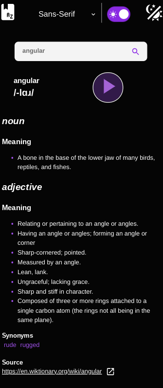
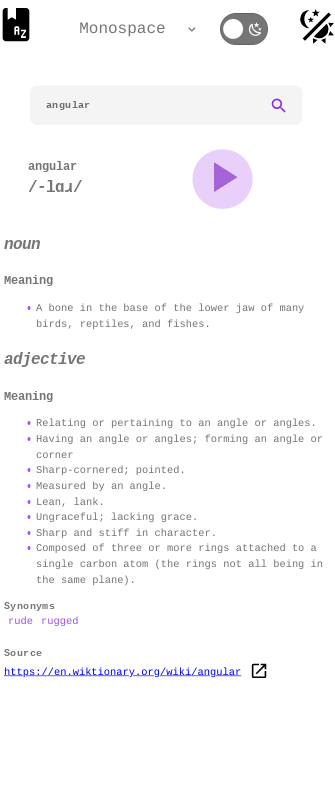

# Angular 17 Dictionary App

[This](https://jdegand.github.io/angular-17-dictionary-app/) is a conversion of my previous [Angular Dictionary App](https://github.com/jdegand/angular-dictionary-app) to Angular 17. 

## Screenshots



***



***

## Built With

- [Angular CLI](https://github.com/angular/angular-cli) version 17.0.0.
- [Angular](https://angular.dev)
- [Dictionary Api](https://dictionaryapi.dev)

## Thoughts

- I created a new project and added all the necessary files from my previous repo.  I ran `ng generate @angular/core:control-flow` to update the template syntax of all components.  
- 4 files were changed and only `word-details.component.html` had problems. Sidenote: The formatting of the returned code generated by Angular is slightly off.  Apparently, with the new version of Angular control flow, you can't combine async pipe with a @for of loop like you could with a ngFor.

```javascript
@if (errorResponse) {
<div class="app__error">{{ errorResponse.message }}</div>
}
<div>
  @for (
      word of word$ | async; track 
      word; let onlyFirstEntryWord = $first; let lastEntrySource = $last) {
  <article
   
  >
    @if (onlyFirstEntryWord) {
<section class="article__heading">
      <div class="article__heading__left">
        <h1 class="article-h1">{{ word.word }}</h1>
        <h2>{{ word.phonetic }}</h2>
      </div>
      <div class="article__heading__right">
        @for (
            phonetic of findAudio(word.phonetics); track 
            phonetic; let firstAudio = $first) {
  <div
         
        >
          @if (firstAudio) {
<div class="player-div">
            <app-player audioSrc="{{ phonetic.audio }}"></app-player>
          </div>
}
        </div>
}
      </div>
    </section>
}
    @for (meaning of word.meanings; track meaning) {
  <section class="article__word__props">
      <app-meaning [meaning]="meaning"></app-meaning>
    </section>
}
    @if (lastEntrySource) {
<section class="article__source">
      <h4>Source</h4>
      @for (el of word.sourceUrls; track el) {
  <div>
        <app-source [source]="el"></app-source>
      </div>
}
    </section>
}
  </article>
}
</div>
```

- Using the code above gives an error that reads: `Type '{}' must have a '[Symbol.iterator]()' method that returns an iterator.ngtsc(2488) error after running control-flow command`.  To see the error, you would need to revert `word-details` folder and `app.config` back to my original implementation.  See [my old repo](https://github.com/jdegand/angular-dictionary-app) for the code.  
- I changed my approach to use fetch, withComponentInputBinding and await/async instead of HttpClient, queryParamMap and asyncPipe.

## How to Use

To clone and run this application, you'll need [Git](https://git-scm.com) and [Node.js](https://nodejs.org/en/download/) (which comes with [npm](http://npmjs.com)) installed on your computer. From your command line:

```bash
# Clone this repository
$ git clone https://github.com/jdegand/angular-17-dictionary-app.git

# Install dependencies
$ npm install

# Run the app and navigate to localhost:4200
$ npm start
```

## Continued Development

- Error Handling -> using fetch etc -> doesn't catchError   
- The form doesn't reset when you navigate back to the home page with the book icon.
- Typescript typing -> the returned objects from dictionary app previously had flaws so can't use typing there
- CORS issue -> There is a possible server issue (CORS) that prevents audio from being played.  The API has had intermittent issues in the past and there have been issues with CORS in the past.  It could be related to the API provider.     

## Useful Resources

- [Stack Overflow](https://stackoverflow.com/questions/36835123/how-do-i-pass-data-to-angular-routed-components) - how do i pass data to angular routed components
- [YouTube](https://www.youtube.com/watch?v=5K10oYJ5Y-E) - HTTP in Angular - Learning Angular (Part 8)
- [Stack Overflow](https://stackoverflow.com/questions/56092083/async-await-in-angular-ngoninit) - async await in angular ngOnInit
